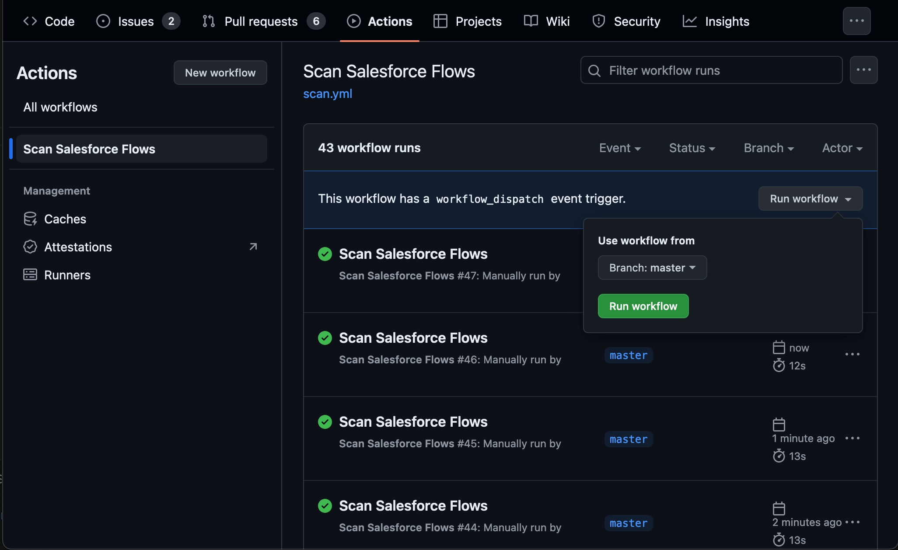

*Pinpoint deviations from Industry Best Practices in Salesforce Flows during Pull Requests and ensure standards of business automation excellence.*


_Additional information on the engine can be found in the [Lightning Flow Scanner Documentation](https://lightning-flow-scanner.github.io/lightning-flow-scanner-core/)._


## Usage

To use this action in your workflow, create a file named `.github/workflows/lightning-flow-scanner.yml` with the following content:

```yaml
name: lightning-flow-scanner
on:
  workflow_dispatch:
  pull_request:
jobs:
  action:
    runs-on: ubuntu-latest
    steps:
      - name: Get Latest Version
        uses: actions/checkout@v4
      - name: Scan Salesforce Flows
        uses: RubenHalman/lightning-flow-scanner-action@1.0.0
        with:
            GITHUB_TOKEN: ${{ secrets.GITHUB_TOKEN }}
```


#### Automatically Runs On Pull Requests: 
This action will apply automatically on pull requests (PRs) to your repository. When a pull request is opened or updated, the action will scan Salesforce Flows in the PR's changed files and report any violations.

#### Or Run It Manually:
To run the action manually, follow these steps:
    1. Navigate to the "Actions" tab of your GitHub repository.
    2. Click on "Scan Salesforce Flows" in the list of available workflows.
    3. Press the "Run workflow" button to trigger the action.



## Development Setup

#### Repository Configuration

Ensure the following:
- Workflows have read and write permissions in the repository for all scopes.
- Allow GitHub Actions to create and approve pull requests

#### Debug Locally with Act
To debug the action locally you need to ensure you have `npm` and `act` installed and follow these steps:

1. Create a local secrets file: Create a .secrets file in the root of your repository with the following content:
`GITHUB_TOKEN=<your-personal-access-token>`
Replace <your-personal-access-token> with a GitHub Personal Access Token (PAT). You can generate one from your GitHub account settings.
2. Run `npm run build` to compile a new version
3. Run act: Use the act command to run the workflow.
test the action on all files:
`act workflow_dispatch`
